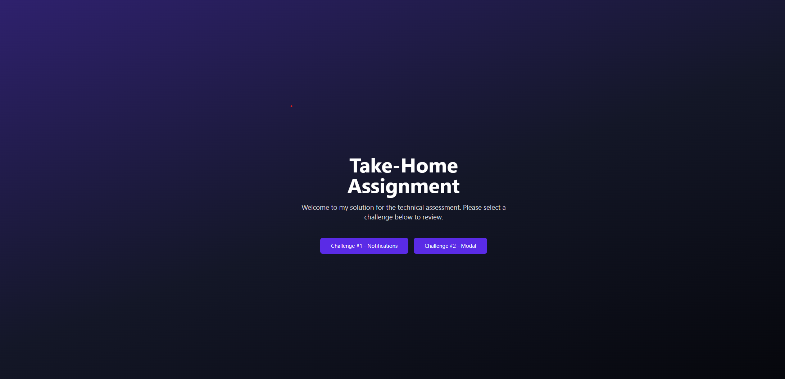
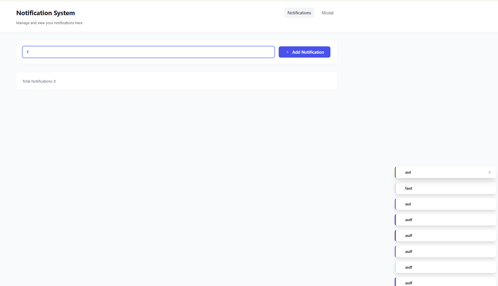
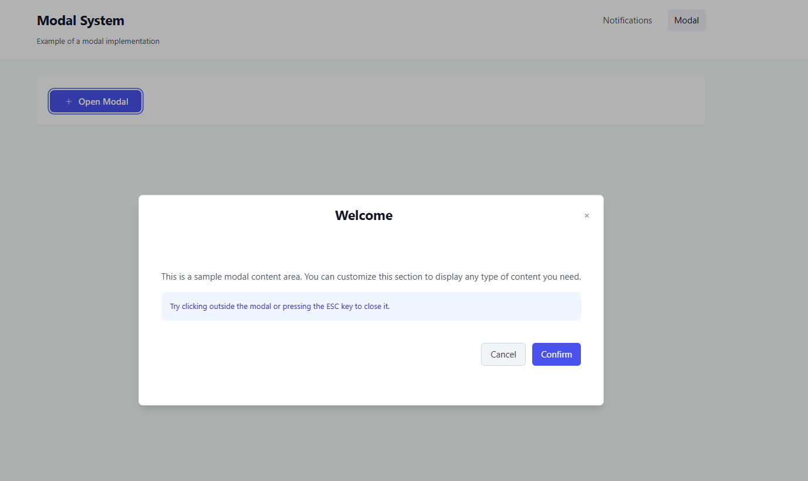
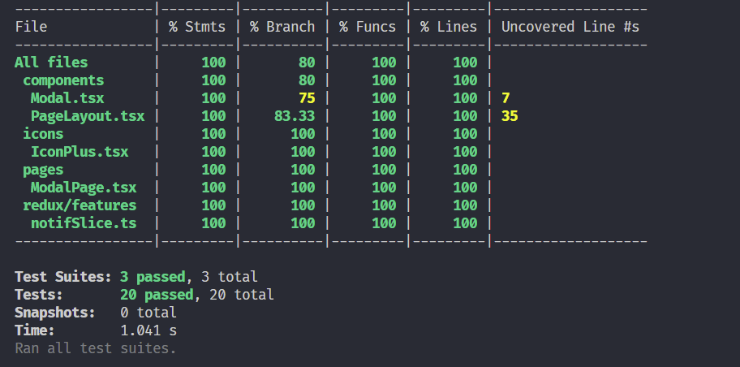

# Nacelle Frontend Engineering Challenge

## Setup instructions

1. Clone this repository to your local machine.
2. Install dependencies using `npm install` or `yarn install`.
3. Start the development server using `npm run dev` or `yarn dev`.
4. Open your browser and navigate to `http://localhost:5173` to view the application.

## Technologies Used

- **React:** A popular JavaScript library for building user interfaces.
- **Tailwind CSS:** A utility-first CSS framework for building custom designs quickly.
- **Vite:** A modern build tool that serves your code via native ES Module imports during development for faster performance.
- **TypeScript:** A statically typed superset of JavaScript that enhances code quality and developer productivity.
- **Redux Toolkit:** A simplified state management library for managing application state efficiently.
- **Jest:** A unit testing tool designed for the modern web.

## Features && approaches

### Redux Notification List:

Created a notification system with Redux state management. Used Redux Toolkit to implement the store and actions.

1. Create a NotificationList component that displays current notifications
2. Add an "Add Notification" button that creates new notifications
3. Allow clicking a notification to remove it
4. Implement basic styling to distinguish notifications
5. Write tests for core functionality:
   - Adding notifications
   - Removing notifications
   - NotificationList rendering
   - Redux store updates

### Basic Modal Component:

1. Core Components:
   - Title
   - Close button
   - Content area
   - Backdrop
2. Functionality:
   - Close on ESC key
   - Close on backdrop click
   - Basic focus management
3. Tests:
   - Opening/closing
   - Keyboard interaction
   - Content rendering

Happy coding! 🚀

## Screenshots

